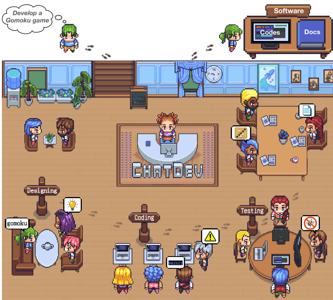

# 页 2
  
Figure 1: ChatDev, a chat-powered software development framework, integrates LLM agents with various social roles, working autonomously to develop comprehensive solutions via multi-agent collaboration.