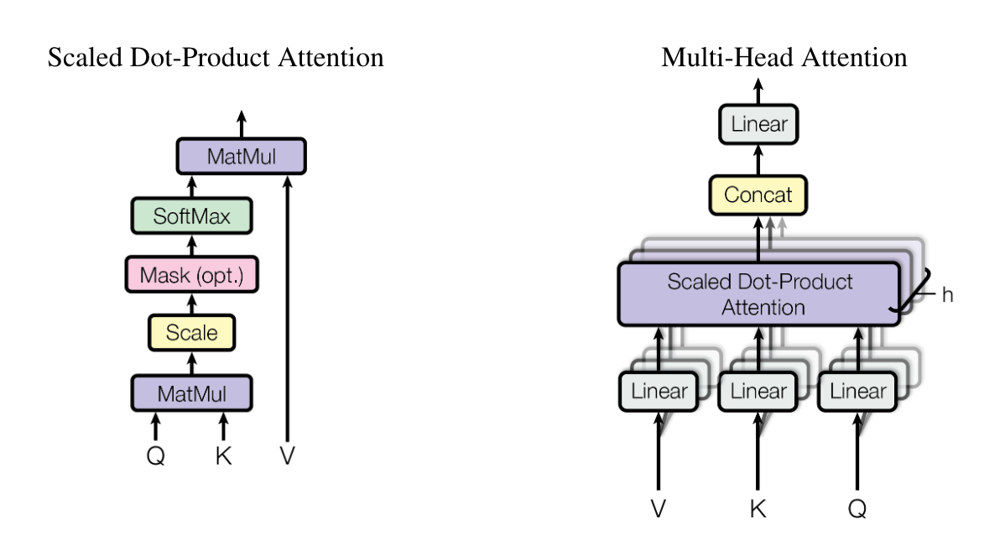

# 页 4
An attention function can be described as mapping a query and a set of key- value pairs to an output, where the query, keys, values, and output are all vectors. The output is computed as a weighted sum

  
Figure 2: (left) Scaled Dot-Product Attention. (right) Multi-Head Attention consists of several attention layers running in parallel.

of the values, where the weight assigned to each value is computed by a compatibility function of the query with the corresponding key.