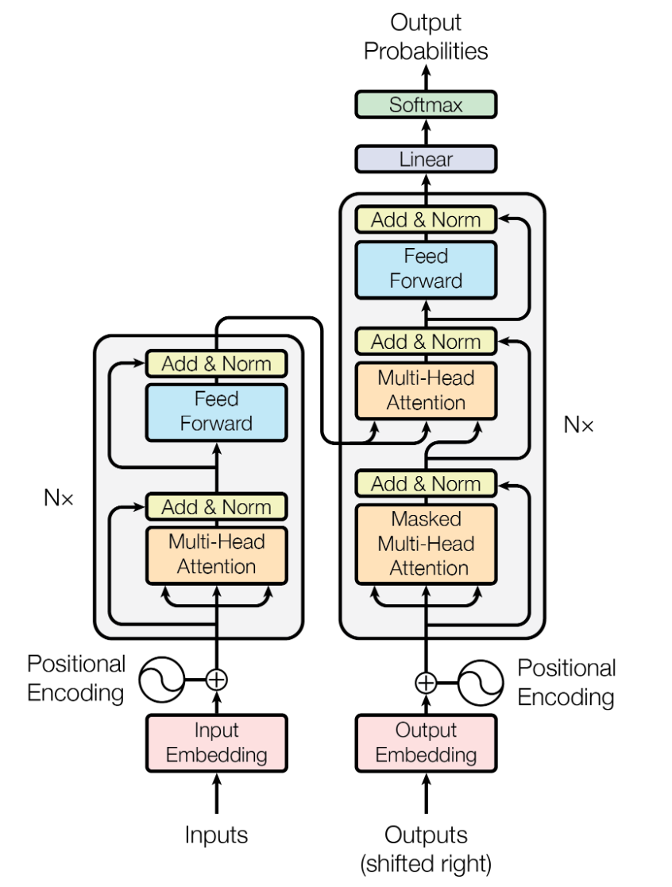

# 3 Model Architecture

3 Model ArchitectureMost competitive neural sequence transduction models have an encoder- decoder structure [5, 2, 35]. Here, the encoder maps an input sequence of symbol representations  $(x_{1},\ldots ,x_{n})$  to a sequence of continuous representations  $\mathbf{z} = (z_{1},\ldots ,z_{n})$ . Given  $\mathbf{z}$ , the decoder then generates an output sequence  $(y_{1},\ldots ,y_{m})$  of symbols one element at a time. At each step the model is auto- regressive [10], consuming the previously generated symbols as additional input when generating the next.

Figure 1: The Transformer - model architecture.

The Transformer follows this overall architecture using stacked self- attention and point- wise, fully connected layers for both the encoder and decoder, shown in the left and right halves of Figure 1, respectively.

# 3.1 Encoder and Decoder Stacks

Encoder: The encoder is composed of a stack of  $N = 6$  identical layers. Each layer has two sub- layers. The first is a multi- head self- attention mechanism, and the second is a simple, positionwise fully connected feed- forward network. We employ a residual connection [11] around each of the two sub- layers, followed by layer normalization [1]. That is, the output of each sub- layer is  $\mathrm{LayerNorm}(x + \mathrm{Sublayer}(x))$ , where  $\mathrm{Sublayer}(x)$  is the function implemented by the sub- layer itself. To facilitate these residual connections, all sub- layers in the model, as well as the embedding layers, produce outputs of dimension  $d_{\mathrm{model}} = 512$ .

Decoder: The decoder is also composed of a stack of  $N = 6$  identical layers. In addition to the two sub- layers in each encoder layer, the decoder inserts a third sub- layer, which performs multi- head attention over the output of the encoder stack. Similar to the encoder, we employ residual connections around each of the sub- layers, followed by layer normalization. We also modify the self- attention sub- layer in the decoder stack to prevent positions from attending to subsequent positions. This masking, combined with fact that the output embeddings are offset by one position, ensures that the predictions for position  $i$  can depend only on the known outputs at positions less than  $i$ .

# 3.2 Attention

An attention function can be described as mapping a query and a set of key- value pairs to an output, where the query, keys, values, and output are all vectors. The output is computed as a weighted sum

 
Figure 2: (left) Scaled Dot-Product Attention. (right) Multi-Head Attention consists of several attention layers running in parallel.

of the values, where the weight assigned to each value is computed by a compatibility function of the query with the corresponding key.

# 3.2.1 Scaled Dot-Product Attention

We call our particular attention "Scaled Dot- Product Attention" (Figure 2). The input consists of queries and keys of dimension  $d_{k}$ , and values of dimension  $d_{v}$ . We compute the dot products of the query with all keys, divide each by  $\sqrt{d_{k}}$ , and apply a softmax function to obtain the weights on the values.

In practice, we compute the attention function on a set of queries simultaneously, packed together into a matrix  $Q$ . The keys and values are also packed together into matrices  $K$  and  $V$ . We compute the matrix of outputs as:

$$
\mathrm{Attention}(Q,K,V) = \mathrm{softmax}(\frac{QK^T}{\sqrt{d_k}})V \tag{1}
$$

The two most commonly used attention functions are additive attention [2], and dot- product (multiplicative) attention. Dot- product attention is identical to our algorithm, except for the scaling factor of  $\frac{1}{\sqrt{d_{k}}}$ . Additive attention computes the compatibility function using a feed- forward network with a single hidden layer. While the two are similar in theoretical complexity, dot- product attention is much faster and more space- efficient in practice, since it can be implemented using highly optimized matrix multiplication code.

While for small values of  $d_{k}$  the two mechanisms perform similarly, additive attention outperforms dot product attention without scaling for larger values of  $d_{k}$  [3]. We suspect that for large values of  $d_{k}$ , the dot products grow large in magnitude, pushing the softmax function into regions where it has extremely small gradients4. To counteract this effect, we scale the dot products by  $\frac{1}{\sqrt{d_{k}}}$ .

# 3.2.2 Multi-Head Attention

Instead of performing a single attention function with  $d_{\mathrm{model}}$  - dimensional keys, values and queries, we found it beneficial to linearly project the queries, keys and values  $h$  times with different, learned linear projections to  $d_{k},d_{k}$  and  $d_{v}$  dimensions, respectively. On each of these projected versions of queries, keys and values we then perform the attention function in parallel, yielding  $d_{v}$  - dimensional

output values. These are concatenated and once again projected, resulting in the final values, as depicted in Figure 2.

Multi- head attention allows the model to jointly attend to information from different representation subspaces at different positions. With a single attention head, averaging inhibits this.

$$
\begin{array}{rl} & {\mathrm{MultiHead}(Q,K,V) = \mathrm{Constant}(\mathrm{head}_1,\dots,\mathrm{head}_{\mathrm{h}})W^O}\\ & {\qquad \mathrm{where~head}_{\mathrm{i}} = \mathrm{Attention}(QW_i^Q,KW_i^K,VW_i^V)} \end{array}
$$

Where the projections are parameter matrices  $W_{i}^{Q}\in \mathbb{R}^{d_{\mathrm{model}}\times d_{k}}$ $W_{i}^{K}\in \mathbb{R}^{d_{\mathrm{model}}\times d_{k}}$ $W_{i}^{V}\in \mathbb{R}^{d_{\mathrm{model}}\times d_{v}}$  and  $W^{O}\in \mathbb{R}^{h d_{v}\times d_{\mathrm{model}}}$

In this work we employ  $h = 8$  parallel attention layers, or heads. For each of these we use  $d_{k} = d_{v} = d_{\mathrm{model}} / h = 64$  . Due to the reduced dimension of each head, the total computational cost is similar to that of single- head attention with full dimensionality.

# 3.2.3 Applications of Attention in our Model

The Transformer uses multi- head attention in three different ways:

- In "encoder-decoder attention" layers, the queries come from the previous decoder layer, and the memory keys and values come from the output of the encoder. This allows every position in the decoder to attend over all positions in the input sequence. This mimics the typical encoder-decoder attention mechanisms in sequence-to-sequence models such as [38, 2, 9].- The encoder contains self-attention layers. In a self-attention layer all of the keys, values and queries come from the same place, in this case, the output of the previous layer in the encoder. Each position in the encoder can attend to all positions in the previous layer of the encoder.- Similarly, self-attention layers in the decoder allow each position in the decoder to attend to all positions in the decoder up to and including that position. We need to prevent leftward information flow in the decoder to preserve the auto-regressive property. We implement this inside of scaled dot-product attention by masking out (setting to  $-\infty$ ) all values in the input of the softmax which correspond to illegal connections. See Figure 2.

# 3.3 Position-wise Feed-Forward Networks

In addition to attention sub- layers, each of the layers in our encoder and decoder contains a fully connected feed- forward network, which is applied to each position separately and identically. This consists of two linear transformations with a ReLU activation in between.

$$
\mathrm{FFN}(x) = \max (0,xW_1 + b_1)W_2 + b_2 \tag{2}
$$

While the linear transformations are the same across different positions, they use different parameters from layer to layer. Another way of describing this is as two convolutions with kernel size 1. The dimensionality of input and output is  $d_{\mathrm{model}} = 512$ , and the inner- layer has dimensionality  $d_{ff} = 2048$ .

# 3.4 Embeddings and Softmax

Similarly to other sequence transduction models, we use learned embeddings to convert the input tokens and output tokens to vectors of dimension  $d_{\mathrm{model}}$ . We also use the usual learned linear transformation and softmax function to convert the decoder output to predicted next- token probabilities. In our model, we share the same weight matrix between the two embedding layers and the pre- softmax linear transformation, similar to [30]. In the embedding layers, we multiply those weights by  $\sqrt{d_{\mathrm{model}}}$ .

Table 1: Maximum path lengths, per-layer complexity and minimum number of sequential operations for different layer types.  $n$  is the sequence length,  $d$  is the representation dimension,  $k$  is the kernel size of convolutions and  $r$  the size of the neighborhood in restricted self-attention.  

<table><tr><td>Layer Type</td><td>Complexity per Layer</td><td>Sequential Operations</td><td>Maximum Path Length</td></tr><tr><td>Self-Attention</td><td>O(n²·d)</td><td>O(1)</td><td>O(1)</td></tr><tr><td>Recurrent</td><td>O(n·d²)</td><td>O(n)</td><td>O(n)</td></tr><tr><td>Convolutional</td><td>O(k·n·d²)</td><td>O(1)</td><td>O(logk(n))</td></tr><tr><td>Self-Attention (restricted)</td><td>O(r·n·d)</td><td>O(1)</td><td>O(n/r)</td></tr></table>

# 3.5 Positional Encoding

Since our model contains no recurrence and no convolution, in order for the model to make use of the order of the sequence, we must inject some information about the relative or absolute position of the tokens in the sequence. To this end, we add "positional encodings" to the input embeddings at the bottoms of the encoder and decoder stacks. The positional encodings have the same dimension  $d_{\mathrm{model}}$  as the embeddings, so that the two can be summed. There are many choices of positional encodings, learned and fixed [9].

In this work, we use sine and cosine functions of different frequencies:

$$
\begin{array}{r}PE_{(pos,2i)} = sin(pos / 10000^{2i / d_{\mathrm{model}}})\\ PE_{(pos,2i + 1)} = cos(pos / 10000^{2i / d_{\mathrm{model}}}) \end{array}
$$

where pos is the position and  $i$  is the dimension. That is, each dimension of the positional encoding corresponds to a sinusoid. The wavelengths form a geometric progression from  $2\pi$  to 10000-  $2\pi$  .We chose this function because we hypothesized it would allow the model to easily learn to attend by relative positions, since for any fixed offset  $k$ $PE_{pos + k}$  can be represented as a linear function of  $PE_{pos}$

We also experimented with using learned positional embeddings [9] instead, and found that the two versions produced nearly identical results (see Table 3 row (E). We chose the sinusoidal version because it may allow the model to extrapolate to sequence lengths longer than the ones encountered during training.

# 4Why Self-Attention

In this section we compare various aspects of self- attention layers to the recurrent and convolutional layers commonly used for mapping one variable- length sequence of symbol representations  $(x_{1},\ldots ,x_{n})$  to another sequence of equal length  $(z_{1},\ldots ,z_{n})$  , with  $x_{i},z_{i}\in \mathbb{R}^{d}$  , such as a hidden layer in a typical sequence transduction encoder or decoder. Motivating our use of self- attention we consider three desiderata.

One is the total computational complexity per layer. Another is the amount of computation that can be parallelized, as measured by the minimum number of sequential operations required.

The third is the path length between long- range dependencies in the network. Learning long- range dependencies is a key challenge in many sequence transduction tasks. One key factor affecting the ability to learn such dependencies is the length of the paths forward and backward signals have to traverse in the network. The shorter these paths between any combination of positions in the input and output sequences, the easier it is to learn long- range dependencies [12]. Hence we also compare the maximum path length between any two input and output positions in networks composed of the different layer types.

As noted in Table 1, a self- attention layer connects all positions with a constant number of sequentially executed operations, whereas a recurrent layer requires  $O(n)$  sequential operations. In terms of computational complexity, self- attention layers are faster than recurrent layers when the sequence

length  $n$  is smaller than the representation dimensionality  $d$ , which is most often the case with sentence representations used by state- of- the- art models in machine translations, such as word- piece [38] and byte- pair [31] representations. To improve computational performance for tasks involving very long sequences, self- attention could be restricted to considering only a neighborhood of size  $r$  in the input sequence centered around the respective output position. This would increase the maximum path length to  $O(n / r)$ . We plan to investigate this approach further in future work.

A single convolutional layer with kernel width  $k < r$  does not connect all pairs of input and output positions. Doing so requires a stack of  $O(n / k)$  convolutional layers in the case of contiguous kernels, or  $O(\log_k(m))$  in the case of dilated convolutions [18], increasing the length of the longest paths between any two positions in the network. Convolutional layers are generally more expensive than recurrent layers, by a factor of  $k$ . Separable convolutions [6], however, decrease the complexity considerably, to  $O(k \cdot n \cdot d + n \cdot d^2)$ . Even with  $k = n$ , however, the complexity of a separable convolution is equal to the combination of a self- attention layer and a point- wise feed- forward layer, the approach we take in our model.

As side benefit, self- attention could yield more interpretable models. We inspect attention distributions from our models and present and discuss examples in the appendix. Not only do individual attention heads clearly learn to perform different tasks, many appear to exhibit behavior related to the syntactic and semantic structure of the sentences.

