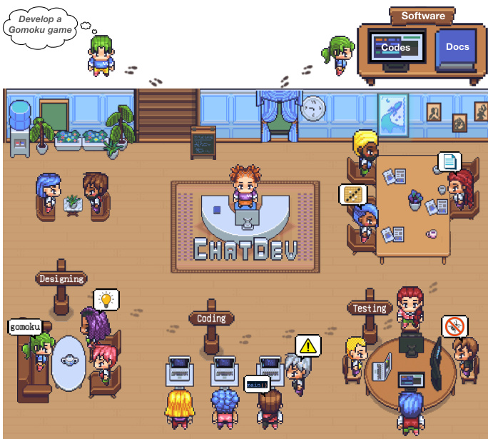

# 1 Introduction  

Large language models (LLMs) have led to substantial transformations due to their ability to effortlessly integrate extensive knowledge expressed in language (Brown et al., 2020; Bubeck et al., 2023), combined with their strong capacity for roleplaying within designated roles (Park et al., 2023; Hua et al., 2023; Chen et al., 2023b). This advancement eliminates the need for model-specific designs and delivers impressive performance in diverse downstream applications. Furthermore, autonomous agents (Richards, 2023; Zhou et al., 2023a) have gained attention for enhancing the capabilities of LLMs with advanced features such as context-aware memory (Sumers et al., 2023), multistep planning (Liu et al., 2023), and strategic tool using (Schick et al., 2023).  

  
Figure 1: ChatDev, a chat-powered software development framework, integrates LLM agents with various social roles, working autonomously to develop comprehensive solutions via multi-agent collaboration.  

Software development is a complex task that necessitates cooperation among multiple members with diverse skills (e.g., architects, programmers, and testers) (Basili, 1989; Sawyer and Guinan, 1998). This entails extensive communication among different roles to understand and analyze requirements through natural language, while also encompassing development and debugging using programming languages (Ernst, 2017; Banker et al., 1998). Numerous studies use deep learning to improve specific phases of the waterfall model in software development, such as design, coding, and testing (Pudlitz et al., 2019; Martín and Abran, 2015;  

Gao et al., 2019; Wang et al., 2016). Due to these technical inconsistencies, methods employed in different phases remain isolated until now. Every phase, from data collection and labeling to model training and inference, requires its unique designs, leading to a fragmented and less efficient development process in the field (Freeman et al., 2001; Ernst, 2017; Winkler et al., 2020).  

Motivated by the expert-like potential of autonomous agents, we aim to establish language as a unifying bridge—utilizing multiple LLM-powered agents with specialized roles for cooperative software development through language-based communication across different phases; solutions in different phases are derived from their multi-turn dialogues, whether dealing with text or code. Nevertheless, due to the tendency of LLM hallucinations (Dhuliawala et al., 2023; Zhang et al., 2023b), the strategy of generating software through communicative agents could lead to the non-trivial challenge of coding hallucinations, which involves the generation of source code that is incomplete, unexecutable, or inaccurate, ultimately failing to fulfill the intended requirements (Agnihotri and Chug, 2020). The frequent occurrence of coding hallucination in turn reflects the constrained autonomy of agents in task completion, inevitably demanding additional manual intervention and thereby hindering the immediate usability and reliability of the generated software (Ji et al., 2023).  

In this paper, we propose ChatDev (see Figure 1), a chat-powered software-development framework integrating multiple "software agents" for active involvement in three core phases of the software lifecycle: design, coding, and testing. Technically, ChatDev uses a chat chain to divide each phase into smaller subtasks further, enabling agents’ multi-turn communications to cooperatively propose and develop solutions (e.g., creative ideas or source code). The chain-structured workflow guides agents on what to communicate, fostering cooperation and smoothly linking natural- and programming-language subtasks to propel problemsolving. Additionally, to minimize coding hallucinations, ChatDev includes an communicative dehallucination mechanism, enabling agents to actively request more specific details before giving direct responses. The communication pattern instructs agents on how to communicate, enabling precise information exchange for effective solution optimization while reducing coding hallucinations. We built a comprehensive dataset containing software requirement descriptions and conducted comprehensive analyses. The results indicate that ChatDev notably improves the quality of software, leading to improved completeness, executability, and better consistency with requirements. Further investigations reveal that natural-language communications contribute to comprehensive system design, while programming-language communications drive software optimization. In summary, the proposed paradigm demonstrates how linguistic communication facilitates multi-agent collaboration, establishing language as a unifying bridge for autonomous task-solving among LLM agents.  

  
Figure 1: ChatDev, a chat-powered software development framework, integrates LLM agents with various social roles, working autonomously to develop comprehensive solutions via multi-agent collaboration.  

