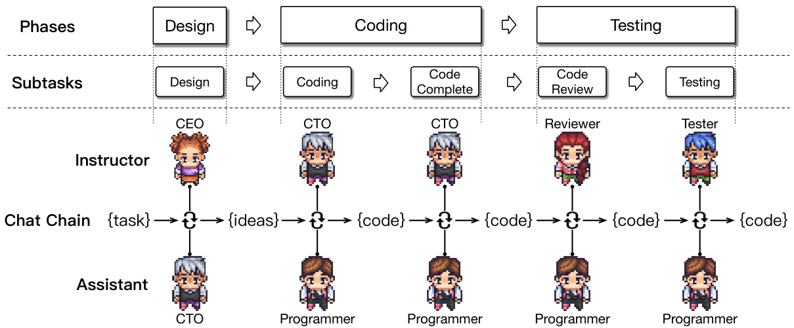

# 2 Related Work  

Trained on vast datasets to comprehend and manipulate billions of parameters, LLMs have become pivotal in natural language processing due to their seamless integration of extensive knowledge (Brown et al., 2020; Bubeck et al., 2023; Vaswani et al., 2017; Radford et al.; Touvron et al., 2023; Wei et al., 2022a; Shanahan et al., 2023; Chen et al., 2021; Brants et al., 2007; Chen et al., 2021; Ouyang et al., 2022; Yang et al., 2023a; Qin et al., 2023b; Kaplan et al., 2020). Furthermore, LLMs have demonstrated strong role-playing abilities (Li et al., 2023a; Park et al., 2023; Hua et al., 2023; Chan et al., 2023; Zhou et al., 2023b; Chen et al., 2023b,a; Cohen et al., 2023; Li et al., 2023b). Recent progress, particularly in the field of autonomous agents (Zhou et al., 2023a; Wang et al., 2023a; Park et al., 2023; Wang et al., 2023e; Richards, 2023; Osika, 2023; Wang et al., 2023d), is largely attributed to the foundational advances in LLMs. These agents utilize the robust capabilities of LLMs, displaying remarkable skills in memory (Park et al., 2023; Sumers et al., 2023), planning (Chen et al., 2023b; Liu et al., 2023) and tool use (Schick et al., 2023; Cai et al., 2023; Qin et al., 2023a; Ruan et al., 2023; Yang et al., 2023b), enabling them to reason in complex scenarios (Wei et al., 2022b; Zhao et al., 2023; Zhou et al., $2 0 2 3 \mathrm { a }$ ; Ma et al., 2023; Zhang et al., $2 0 2 3 \mathrm { a }$ ; Wang et al., 2023b; Ding et al., 2023; Weng, 2023).  

Software development is a multifaceted and intricate process that requires the cooperation of multiple experts from various fields (Yilmaz et al., 2012; Acuna et al., 2006; Basili, 1989; Sawyer and Guinan, 1998; Banker et al., 1998; France and Rumpe, 2007), encompassing the requirement analysis and system design in natural languages (Pudlitz et al., 2019; Martín and Abran, 2015; Nahar et al., 2022), along with system development and debugging in programming languages (Gao et al., 2019; Wang et al., 2016; Wan et al., 2022). Numerous studies employ the waterfall model, a particular software development life cycle, to segment the process into discrete phases (e.g., design, coding, testing) and apply deep learning to improve the effectiveness of certain phases (Winkler et al., 2020; Ezzini et al., 2022; Thaller et al., 2019; Zhao et al., 2021; Nijkamp et al., 2023; Wan et al., 2018; Wang et al., 2021).  

  
Figure 2: Upon receiving a preliminary task requirement (e.g., “develop a Gomoku game”), these software agents engage in multi-turn communication and perform instruction-following along a chain-structured workflow, collaborating to execute a series of subtasks autonomously to craft a comprehensive solution.  

