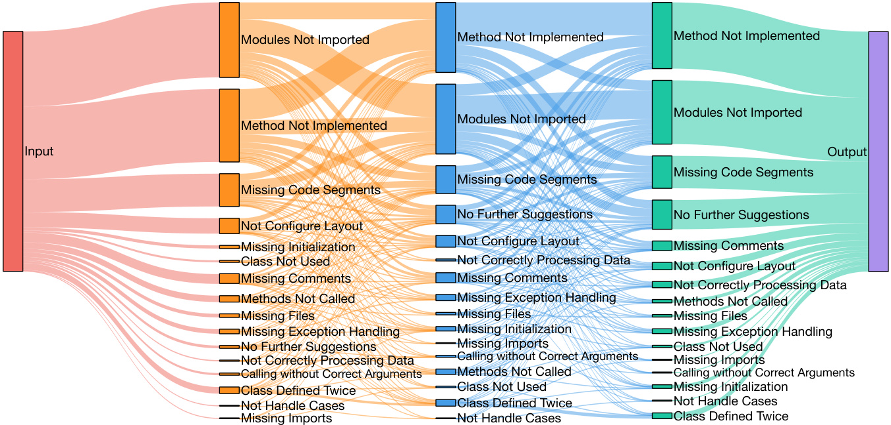
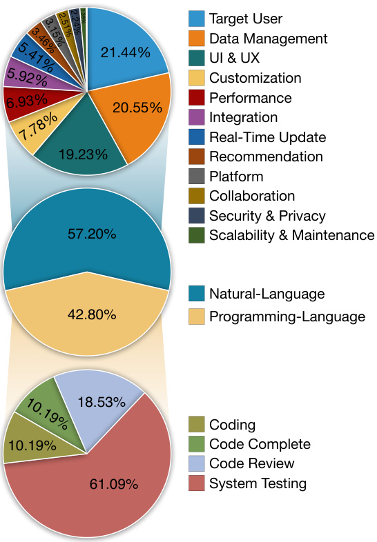
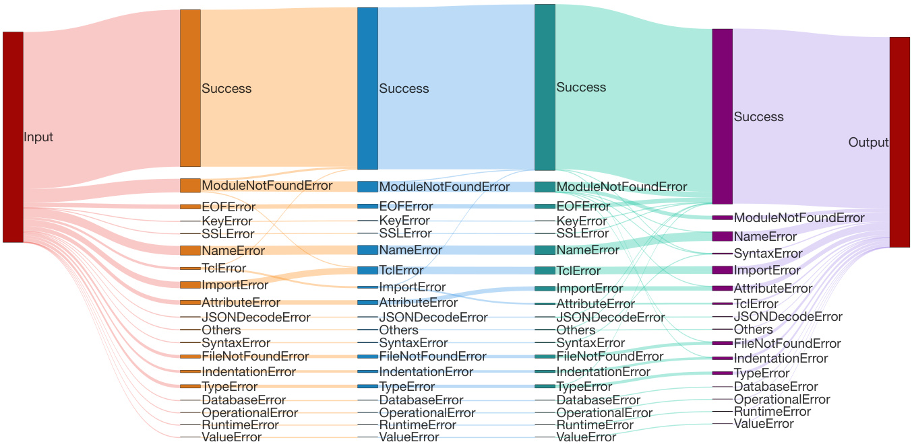

# 4 Evaluation  

Baselines We chose some representative LLMbased software development methods as our baselines. GPT-Engineer (Osika, 2023) is a fundamental single-agent approach in LLM-driven software agents with a precise understanding of task requirements and the application of one-step reasoning, which highlights its efficiency in generating detailed software solutions at the repository level.  

MetaGPT (Hong et al., 2023) is an advanced framework that allocates specific roles to various LLMdriven software agents and incorporates standardized operating procedures to enable multi-agent participation. In each step agents with specific roles generate solutions by adhering to static instructions predefined by human experts.  

Datasets Note that, as of now, there isn’t a publicly accessible dataset containing textual descriptions of software requirements in the context of agent-driven software development. To this end, we are actively working towards developing a comprehensive dataset for software requirement descriptions, which we refer to as SRDD (Software Requirement Description Dataset). Drawing on previous work (Li et al., 2023a), we utilize existing software descriptions as initial examples, which are then further developed through a process that combines LLM-based automatic generation with post-processing refinement guided by humans. As a result, this dataset includes important software categories from popular platforms such as Ubuntu, Google Play, Microsoft Store, and Apple Store. It comprises 1,200 software task prompts that have been carefully categorized into 5 main areas: Education, Work, Life, Game, and Creation. All these areas are further divided into 40 subcategories, and each subcategory contains 30 unique task prompts.  

Metrics Evaluating software is also a challenging task, especially when trying to assess it on a holistic level. Under the current limitation of scarce benchmark resources, traditional function-oriented code generation metrics (e.g., pass@k), cannot seamlessly transfer to a comprehensive evaluation of entire software systems. The main reason for this is that it is often impractical to develop manual or automated test cases for various types of software, especially those involving complex interfaces, frequent user interactions, or non-deterministic feedback. As an initial strategy, we apply three fundamental and objective dimensions that reflect different aspects of coding hallucinations to evaluate the agent-generated software, and then integrate them to facilitate a more holistic evaluation:  

Completeness measures the software’s ability to fulfill code completion in software development, quantified as the percentage of software without any "placeholder" code snippets. A higher score indicates a higher probability of automated completion.  

Table 1: Overall performance of the LLM-powered software development methods, encompassing both single-agent $( \ntrianglerighteq { \overbrace { \frac { 2 } { 3 } } } )$ and multi-agent $( \frac { \widehat { \mathbb { A } } } { z } , \frac { \widehat { \mathbb { A } } } { | z - z | } )$ paradigms. Performance metrics are averaged for all tasks. The top scores are in bold, with second-highest underlined. $\dagger$ indicates significant statistical differences $\mathrm { ( p { \leq } 0 . 0 5 ) }$ between a baseline and ours.   

<html><body><table><tr><td>Method</td><td>Paradigm</td><td>Completeness</td><td>Executability</td><td>Consistency</td><td>Quality</td></tr><tr><td>GPT-Engineer</td><td></td><td>0.5022t</td><td>0.3583†</td><td>0.7887†</td><td>0.1419†</td></tr><tr><td>MetaGPT</td><td>恩</td><td>0.4834t</td><td>0.4145†</td><td>0.7601†</td><td>0.1523†</td></tr><tr><td>ChatDev</td><td>恩</td><td>0.5600</td><td>0.8800</td><td>0.8021</td><td>0.3953</td></tr></table></body></html>  

Table 2: Pairwise evaluation results.   

<html><body><table><tr><td>Method</td><td>Evaluator</td><td>Baseline Wins</td><td>ChatDev Wins</td><td>Draw</td></tr><tr><td rowspan="2">GPT-Engineer</td><td>GPT-4</td><td>22.50%</td><td>77.08%</td><td>00.42%</td></tr><tr><td>Human</td><td>09.18%</td><td>90.16%</td><td>00.66%</td></tr><tr><td rowspan="2">MetaGPT</td><td>GPT-4</td><td>37.50%</td><td>57.08%</td><td>05.42%</td></tr><tr><td>Human</td><td>07.92%</td><td>88.00%</td><td>04.08%</td></tr></table></body></html>  

Executability assesses the software’s ability to run correctly within a compilation environment, quantified as the percentage of software that compiles successfully and can run directly. A higher score indicates a higher probability of successful execution.  

Consistency measures how closely the generated software code aligns with the original requirement description, quantified as the cosine distance between the semantic embeddings of the textual requirements and the generated software code1. A higher score indicates a greater degree of consistency with the requirements.  

Quality is a comprehensive metric that integrates various factors to assess the overall quality of software, quantified by multiplying2 completeness, executability, and consistency. A higher quality score suggests a higher overall satisfaction with the software generated, implying a lower need for further manual intervention.  

Implementation Details We divided software development into 5 subtasks within 3 phases, assigning specific roles like CEO, CTO, programmer, reviewer, and tester. A subtask would terminate and get a conclusion either after two unchanged code modifications or after 10 rounds of communication. During the code completion, review, and testing, a communicative dehallucination is activated. For ease of identifying solutions, the assistant begins responses with "<SOLUTION>" when  

<html><body><table><tr><td>Method</td><td>Duration (s)</td><td>#Tokens</td><td>#Files</td><td>#Lines</td></tr><tr><td>GPT-Engineer</td><td>15.6000</td><td>7,182.5333</td><td>3.9475</td><td>70.2041</td></tr><tr><td>MetaGPT</td><td>154.0000</td><td>29,278.6510</td><td>4.4233</td><td>153.3000</td></tr><tr><td>ChatDev</td><td>148.2148</td><td>22,949.4450</td><td>4.3900</td><td>144.3450</td></tr></table></body></html>  

Table 3: Software statistics include Duration (time consumed), #Tokens (number of tokens used), #Files (number of code files generated), and #Lines (total lines of code across all files) in the software generation process.  

a consensus is reached. We used ChatGPT-3.5 with a temperature of 0.2 and integrated Python-3.11.4 for feedback. All baselines in the evaluation share the same hyperparameters and settings for fairness.  

# 4.1 Overall Performance  

As illustrated in Table 1, ChatDev outperforms all baseline methods across all metrics, showing a considerable margin of improvement. Firstly, the improvement of ChatDev and MetaGPT over GPT-Engineer demonstrates that complex tasks are difficult to solve in a single-step solution. Therefore, explicitly decomposing the difficult problem into several smaller, more manageable subtasks enhances the effectiveness of task completion. Additionally, in comparison to MetaGPT, ChatDev significantly raises the Quality from 0.1523 to 0.3953. This advancement is largely attributed to the agents employing a cooperative communication method, which involves autonomously proposing and continuously refining source code through a blend of natural and programming languages, as opposed to merely delivering responses based on humanpredefined instructions. The communicative agents guide each subtask towards integrated and automated solutions, efficiently overcoming the restrictions typically linked to manually established optimization rules, and offering a more versatile and adaptable framework for problem-solving.  

To further understand user preferences in practical settings, we use the setting adopted by Li et al. (2023a), where agent-generated solutions are compared in pairs by both human participants and the prevalent GPT-4 model to identify the preferred one.3 Table 2 shows ChatDev consistently outperforming other baselines, with higher average win rates in both GPT-4 and human evaluations.  

Table 4: Ablation study on main components or mechanisms. $\leq x$ denotes halting the chat chain after the completion of the $x$ phrase, and ⧹ denotes the removing operation. CDH denotes the communicative dehallucination mechanism.   

<html><body><table><tr><td>Variant</td><td>Completeness</td><td>Executability</td><td>Consistency</td><td>Quality</td></tr><tr><td>ChatDev</td><td>0.5600</td><td>0.8800</td><td>0.8021</td><td>0.3953</td></tr><tr><td>≤Coding</td><td>0.4100</td><td>0.7700</td><td>0.7958</td><td>0.2512</td></tr><tr><td>≤Complete</td><td>0.6250</td><td>0.7400</td><td>0.7978</td><td>0.3690</td></tr><tr><td>≤Review</td><td>0.5750</td><td>0.8100</td><td>0.7980</td><td>0.3717</td></tr><tr><td>≤Testing</td><td>0.5600</td><td>0.8800</td><td>0.8021</td><td>0.3953</td></tr><tr><td>\CDH</td><td>0.4700</td><td>0.8400</td><td>0.7983</td><td>0.3094</td></tr><tr><td>Roles</td><td>0.5400</td><td>0.5800</td><td>0.7385</td><td>0.2212</td></tr></table></body></html>  

Furthermore, the software statistics presented in Table 3 indicates that the multi-agent paradigm, despite being slower and consuming more tokens than the single-agent method, yields a greater number of code files and a larger codebase, which may enhance the software’s functionality and integrity. Analyzing the dialogues of agents suggests that the multi-agent communication method often leads agents to autonomously offer functional enhancements (e.g., GUI creation or increasing game difficulty), thereby potentially resulting in the incorporation of beneficial features that were not explicitly specified in requirements. Taking all these factors together, we posit that the fundamental characteristics of multi-agent software development take on greater significance, surpassing short-term concerns like time and economic costs in the current landscape.  

# 4.2 Ablation Study  

This section examines key components or mechanisms within our multi-agent cooperation framework by removing particular phases in the chat chain, communicative dehallucination, or the roles assigned to all agents in their system prompts. Figure 4 shows that the code complete phase enhances Completeness, with testing critical for Executability. Quality steadily rises with each step, suggesting that software development optimization is progressively attained through multi-phase communications among intelligent agents. Meanwhile, eliminating communicative dehallucination results in a decrease across all metrics, indicating its effectiveness in addressing coding hallucinations. Most interestingly, the most substantial impact on performance occurs when the roles of all agents are removed from their system prompts. Detailed dialogue analysis shows that assigning a "prefer GUI design" role to a programmer results in generated source code with relevant GUI implementations; in the absence of such role indications, it defaults to implement unfriend command-line-only programs only. Likewise, assigning roles such as a "careful reviewer for bug detection" enhances the chances of discovering code vulnerabilities; without such roles, feedback tends to be high-level, leading to limited adjustments by the programmer. This finding underscores the importance of assigning roles in eliciting responses from LLMs, underscoring the significant influence of multi-agent cooperation on software quality.  

  
Figure 4: The chart demonstrates the distribution of suggestions made by a reviewer agent during a multi-round reviewing process, where each sector in the chart represents a different category of suggestion.  

  
Figure 3: The utterance distribution of agent communications throughout the entire development process.  

# 4.3 Communication Analysis  

Our agent-driven software development paradigm promotes cooperative agents through effective communication for automated solution optimization. Phases in the chat chain have varying levels of engagement in natural and programming languages.  

  
Figure 4: The chart demonstrates the distribution of suggestions made by a reviewer agent during a multi-round reviewing process, where each sector in the chart represents a different category of suggestion.  

We now analyze the content of their communications to understand linguistic effects.  

Figure 3 depicts a communication breakdown, with natural language at $5 7 . 2 0 \%$ . In the naturallanguage phase (i.e., design), natural language communication plays a crucial role in the thorough design of the system, with agents autonomously discussing and designing aspects like target user, data management, and user interface. Post-design phases show a balanced mix of coding, code completion, and testing activities, with most communication occurring during code reviews. This trend is due to agents’ self-reviews and code fixes consistently propelling software development; otherwise, progress halts when successive updates don’t show significant changes, leading to a natural decrease in code review communications.  

We explore the properties of static debugging dynamics in code reviews resulting from communication between reviewers and programmers, as depicted in Figure 4. The data uncovers that during the review phase, reviewers may spot different issues through language interactions. The programmer’s intervention can transform certain issues into different ones or a state where no further suggestions are needed; the increasing proportion of the latter indicates successful software optimization. Particularly, the "Method Not Implemented" issue is most common in communication between reviewers and programmers during code reviews, accounting for $34 . 8 5 \%$ of discussions. This problem usually arises from unclear text requirements and the use of "placeholder" tags in Python code, necessitating additional manual adjustments. Furthermore, the "Module Not Imported" issue often arises due to code generation omitting crucial details. Apart from common problems, reviewers often focus on enhancing code robustness by identifying rare exceptions, unused classes, or potential infinite loops.  

  
Figure 4: The chart demonstrates the distribution of suggestions made by a reviewer agent during a multi-round reviewing process, where each sector in the chart represents a different category of suggestion.  

Likewise, we analyze the tester-programmer communication during the testing phase, illustrating the dynamic debugging dynamics in their multi-turn interactions with compiler feedback, as depicted in Figure 5. The likelihood of successful compilation at each step is generally higher than encountering errors, with most errors persisting and a lower probability of transforming into different errors. The most frequent error is "ModuleNotFound" $( 4 5 . 7 6 \% )$ , followed by "NameError" and "ImportError" (each at $1 5 . 2 5 \%$ ). The observation highlights the model’s tendency to overlook basic elements like an "import" statement, underscoring its difficulty in managing intricate details during code generation. Besides, the tester also detects rarer errors like improperly initialized GUIs, incorrect method calls, missing file dependencies, and unused modules. The communicative dehallucination mechanism effectively resolves certain errors, frequently resulting in "compilation success" after code changes. There’s a significantly low chance of returning to an error state from a successful compilation. Over time, the multi-turn communication process statistically shows a consistent decrease in errors, steadily moving towards successful software execution.  

  
Figure 5: The diagram illustrates the progression of iterations in a multi-round testing process, where each colored column represents a dialogue round, showcasing the evolution of the solution through successive stages of testing.  

  
Figure 5: The diagram illustrates the progression of iterations in a multi-round testing process, where each colored column represents a dialogue round, showcasing the evolution of the solution through successive stages of testing.  

